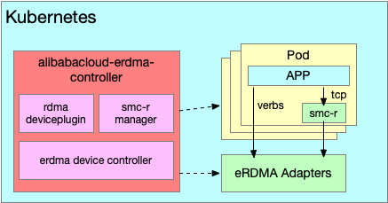

# alibabacloud-erdma-controller
Kubernetes controller for alibabacloud erdma resource

## Description
Dynamic configure erdma devices on kubernetes nodes, and automatically inject erdma-accelerated networks for Kubernetes Pods.



## Getting Started

### Prerequisites
- helm
- Kubernetes Cluster With AlibabaCloud ECS Nodes
- AlibabaCloud Linux 3 with Kernel Version >= 5.10.134-17

### To Deploy on the cluster
#### create & authorize ram role&policy
alibabacloud-erdma-controller need following permissions:
```json
{
  "Version": "1",
  "Statement": [
    {
      "Action": [
        "ecs:DescribeInstances",
        "ecs:DescribeInstanceTypes",
        "ecs:DescribeNetworkInterfaces",
        "ecs:ModifyNetworkInterfaceAttribute",
        "ecs:CreateNetworkInterface",
        "ecs:AttachNetworkInterface"
      ],
      "Resource": [
        "*"
      ],
      "Effect": "Allow"
    }
  ]
}
```
#### prepare configuration
prepare a values.yaml file with the following content to authorize controller to access erdma API:
##### use rrsa authorization
```yaml
credentials:
  type: "oidc_role_arn"
serviceAccount:
  annotations:
    pod-identity.alibabacloud.com/role-name: {your-ram-role-name}
```
*need config rrsa components on ACK, [refer doc.](https://help.aliyun.com/zh/ack/ack-managed-and-ack-dedicated/user-guide/use-rrsa-to-authorize-pods-to-access-different-cloud-services)*

##### use access_key authorization
```yaml
credentials:
  type: "access_key"
  accessKeyID: "{access key}"
  accessKeySecret: "{access key secret}"
```
#### localERIDiscovery mode
To expose existing erdma devices on the node to pods, enable `localERIDiscovery` configuration in values.yaml. This eliminates the need to create and authorize ram roles and policies according to the above steps for accessing the erdma API.
##### expose specified erdma devices on each node
`exposedLocalERIs` field in values.yaml defines which erdma devices are exposed per node. For example:
```yaml
exposedLocalERIs:
  - i-XXX erdma_0/erdma_1 # specify instance ID and erdma devices(erdma_0/erdma_1) to expose
  - i-* erdma_0           # specify erdma devices(erdma_0) to expose for all unspecified nodes
  - i-* erdma_*           # expose all existing erdma devices for all unspecified nodes
```
#### helm install
```sh
helm install -f values.yaml --namespace kube-system alibaba-erdma-controller deploy/helm/
```

#### check status
##### check pods
```sh
kubectl get pod -n kube-system | grep erdma
```
##### check erdma devices
```sh
kubectl get erdmadevices
```
##### check device plugin
```sh
kubectl get node -o yaml | grep aliyun/erdma
```

### Using ERDMA Accelerated Network
#### Pod Configurations to Enable ERDMA Accelerated Network
* add `aliyun/erdma` resource in pod spec # config erdma devices for pod
* `network.alibabacloud.com/erdma-smcr: "true"` # config smcr for pod, dynamicially replace tcp connection to erdma, need `network.alibabacloud.com/erdma` enabled first.

#### Example
```yaml
apiVersion: apps/v1
kind: Deployment
metadata:
  labels:
    app: erdma
  name: erdma
spec:
  replicas: 1
  selector:
    matchLabels:
      app: erdma
  template:
    metadata:
      labels:
        app: erdma
      annotations:
        network.alibabacloud.com/erdma-smcr: "true"
    spec:
      containers:
      - command:
        - sleep
        - "360000"
        image: registry.aliyuncs.com/wangbs/netdia:latest
        name: erdma
        resources:
          limits:
            aliyun/erdma: 1
```

### To Uninstall
uninstall helm
```sh
helm -n kube-system uninstall alibaba-erdma-controller 
```

## Build
### Build Controller
```sh
docker build --tag registry.aliyuncs.com/erdma/controller:latest --target controller .
```
### Build Agent
```sh
docker build --tag registry.aliyuncs.com/erdma/agent:latest --target agent .
```
### Build SMCR_INIT
```sh
docker build --tag registry.aliyuncs.com/erdma/smcr_init:latest --target smcr_init .
```

## License

Copyright 2024.

Licensed under the Apache License, Version 2.0 (the "License");
you may not use this file except in compliance with the License.
You may obtain a copy of the License at

```text
http://www.apache.org/licenses/LICENSE-2.0
```

Unless required by applicable law or agreed to in writing, software
distributed under the License is distributed on an "AS IS" BASIS,
WITHOUT WARRANTIES OR CONDITIONS OF ANY KIND, either express or implied.
See the License for the specific language governing permissions and
limitations under the License.

